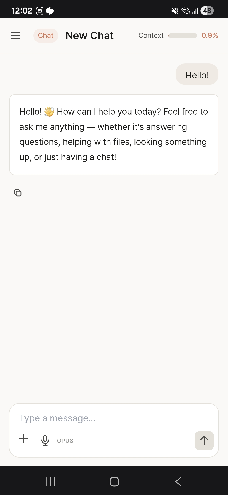
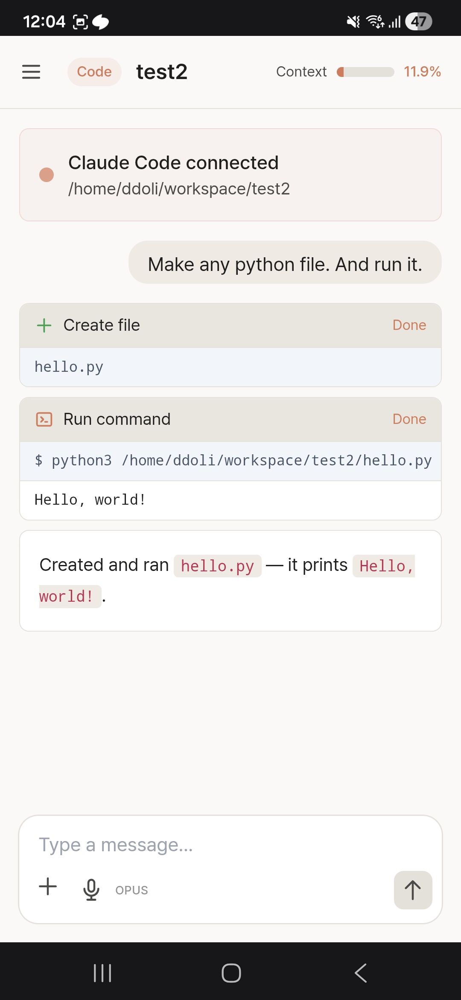
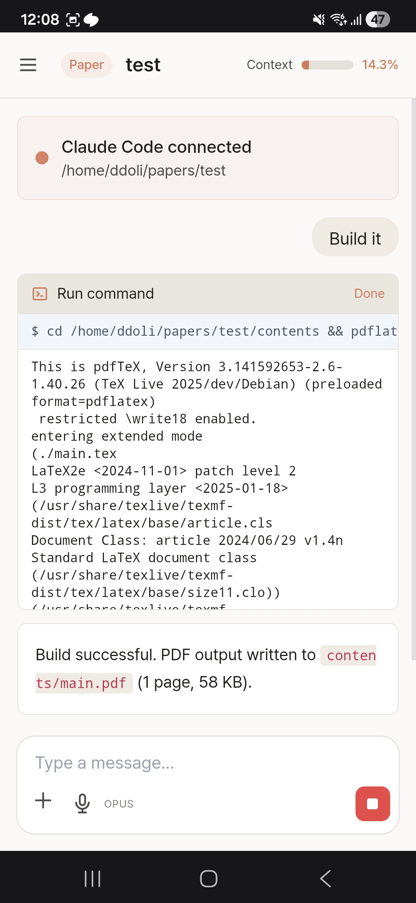

# Ddoli

**Code and write papers from anywhere, on any device.**

Ddoli is a mobile-friendly AI agent tool powered by Claude Code. Deploy it on your server and access a full development environment from your phone, tablet, or any browser — no local setup needed.

<p align="center">
  
  
  
</p>

## Features

- **Chat** — Ask questions, brainstorm ideas, or have a conversation with Claude
- **Code** — Create projects, write and edit code, and run commands — all through Claude Code
- **Paper** — Write LaTeX or Markdown papers with AI assistance and build PDFs instantly
- **Terminal** — Full terminal access to your server via the browser
- **Voice Input** — Speak to Claude using Web Speech API
- **Mobile-first UI** — Designed to work seamlessly on phones and tablets

## Quick Start

### Requirements

- Docker & Docker Compose
- Claude account (Max subscription recommended)

### 1. Clone & Run

```bash
git clone https://github.com/LimEulYoung/ddoli.git
cd ddoli
docker compose up -d
```

The pre-built image will be pulled from Docker Hub on the first run.

### 2. Claude CLI Login

```bash
docker exec -it ddoli-app-1 bash
claude login
```

When a browser authentication URL is displayed, copy it and open it in your local browser to authenticate.

### 3. Access

Open `http://<server-IP>:8000` in your browser.

## Tech Stack

| Component | Purpose |
|-----------|---------|
| Python 3.12 + FastAPI | Web server |
| PostgreSQL 16 | Session/message storage |
| Claude CLI | AI response generation |
| LaTeX (texlive) | Paper PDF builds |
| Chrome Headless | DevTools MCP connection |
| Node.js 22 | Claude CLI & MCP stdio server |
